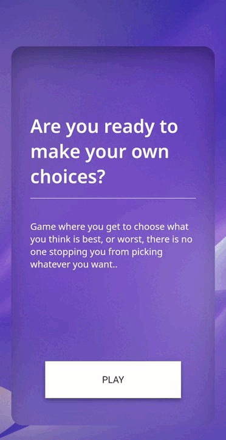

# **Would You Rather?**  - JavaScript, HTML and CSS on frontend and Flask and PostgreSQL on backend

### [Live Webiste](https://asiask97.github.io/would-you-rather/)
### [Backend](https://github.com/asiask97/would-you-rather-backend)

 
 

# Table of Contents 
* [Introduction](#introduction)
* [Features](#features)
* [UX](#ux)
* [Testing](#testing)
* [User Stories](#user-stories)
* [Credits](#credits)
* [Deployment](#deployment)
* [Backend](#backend)

 

# Introduction  

Would You Rather is a small project which consists of two parts, frontend with vanilla JavaScript and backend made with Flask and PostgreSQL database.
   

The whole point of the game is to ask the users to answer a set of questions and display all their results in the form of a pie chart. The purpose of this project is to see what another anonymous user would rather choose. The user gets an option of two choices and must pick the option that they would prefer more, users choice is saved in a database for each answer and then all results are displayed on a chart for the user to see. It's a fun and lighthearted game to kill some time and have a laugh.  

  

**Time frame to finish this project was about 20-25 hours.** 

  
  
 
# Features 

The whole front end of the website consists of four containers that are animated to go in and out depending on the current need. The game starts with a 'start' container which invites the user to play the game. Once the user decides to join, the screen is transitioned to the 'game' window which displays the current question. On the game screen the user gets two very interesting choices to pick from, once the user makes up their mind, they are moved to the results screen where all results of all players are displayed on a pie chart.  

## Start Window  
 
Start page gives a brief explanation of what the user is about to experience. It tells the user what the game is about in a lighthearted way. Once the user decides to play the game they are moved to the 'game' screen. The button on this page on hover shows hidden text, there is an event listener added to this button that fetches all the questions from the database, if a user has slower internet a load spinner is displayed.  

## Game Window 

Here the user gets an especially important question - 'Would you rather?' and a pair of buttons which contain the answers. Users are asked to choose the one that they think is the preferred option. On hover each button displays different fun text as shown in the picture below. Once the users clicks on one of the given options a result is posted to database which increases the overall count for that option. 

## Results Window 

On the Results window we can see a pie chart which displays exact results fetched from the database. Below the pie chart there is a section with the same results but displayed as a percentage. There the user is also reminded of the two questions and how they are linked with colors on the pie chart. When user is done analyzing the results, they can continue the game using the button at the bottom of the screen.  

</a>

## End Window 

# UX
</a>

# Testing
Throughout the project I have kept in mind the performance and best practices. I made sure that my code passes all relevant tests like Validator tests shown below. I have also made sure that the website is fully responsive with the help of Chrome developer tools. 

List of devices which the website was tested on: 
- IPhone SE
- IPhone XR
- IPhone 12 Pro
- Pixel 5
- Samsung Galaxy S8+
- Samsung Galaxy S20 Ultra
- Ipad Air
- Ipad Pro 2020
- Ipad Mini
- Surface Pro 7
- Surface Duo
- Galaxy Fold
- Samsung Galaxy A51/71
- Nest Hub Max

I have also made sure that the website works across a range of browsers like Chrome, Opera, Firefox and Brave.

Each button on the website was tested to make sure it works correctly and that all links are working and are fully functional. Tests were carried out to make sure that form is validating inputs correctly as previously discussed above. 

##  Validator Testing
 

- # [HTML Validator - passed with no issues](https://validator.w3.org/nu/?doc=https%3A%2F%2Fasiask97.github.io%2Fwould-you-rather%2F)
- # [CSS Validator - passed with no issues](https://jigsaw.w3.org/css-validator/validator?uri=https%3A%2F%2Fasiask97.github.io%2Fwould-you-rather%2F&profile=css3svg&usermedium=all&warning=1&vextwarning=&lang=en)
 

##  Lighthouse Testing

### Desktop 

### Mobile 

##  Issues

## Fixes 

# User Stories
### Some of user stories that got completed 

| #           | User Story      
| ----------- | ------------- 
| 1           | As a user I want to be able to clearly see all questions and answers. 
| 2           | As a user I want to be able to have a clear path of the game and not be confused about what to do. 
| 3           | As a user I want to know how other users answered the questions. 
| 4           | As a user I want to be able to start the game when I want to.         
| 5           | As a user I want to enjoy the modern look of a modern app.          
| 6           | As a user I want to play the game on all screen sizes.          
| 7           | As a user I want to know when I have reached the end of all the questions.          
| 8           | As a user I want to see results in a readable and clear to understand way.          
| 9           | As a user I want to see some animation or movement, so the game has a flow throughout.           
| 10          | As a user I want to be able to see when the questions are loading if I have slower internet.    

 
 

### Some of user stories are planned for next sprint

| #           | User Story      
| ----------- | ------------- 
| 1           | As a user I want to be able to go back to the question I left the game on.   
| 2           | As a user I want to share my results on social media.
| 3           | As a user I want to see what my friend and only my friends answered in each question. 
| 4           | As a user I want to have sections or topics of questions.       

 
 

# Credits

I used the fallowing websites and libraries throughout the project: 

- [Google fonts were used to pick out fonts relevant to the design.](https://fonts.google.com/)
- [Images and videos from pexels.com.](https://www.pexels.com/)
- [Loader used to indicate detching data.](https://loading.io/css/)
- [Inspiration for buttons was taken from this website - Button 57.](https://loading.io/css/)
- [Insparation for would you rather questions.](https://www.signupgenius.com/groups/would-you-rather.cfm)
- [Insparation for would you rather questions.](https://www.quizbreaker.com/would-you-rather#difficult-would-you-rather-questions)
- [Insparation for would you rather questions.](https://woulduratherquestions.com/deep-would-you-rather-questions/)
- [Insparation for would you rather questions.](https://www.becomemorecompelling.com/blog/would-you-rather-questions)
- [Insparation for would you rather questions.](https://www.thecoolist.com/would-you-rather-questions/#20_Deep_Would_You_Rather_Questions)
# Deployment
To create A repository, I: 

- Loged into my account 
- Pressed plus on the left side 
- Clicked New repository button 
- Added a name of my repository 
- Made my repository public 
- Added a readme 
- Clicked create repository button 

 
Then I followed the commands that were given to me to make my first commit though CLI on Visual Studio Code. 

 
To deploy this project, I have decided to use GitHub pages as it is only a sample project not a official website. 

To deploy I have made a Repo on GitHub and pushed initial code. Then I have: 

- Navigated to GitHub Repo with current project. 
- Clicked Settings 
- Navigate to Pages tab 
- Choose branch correct branch 
- Press Save button 

The website is now live. 

# Backend